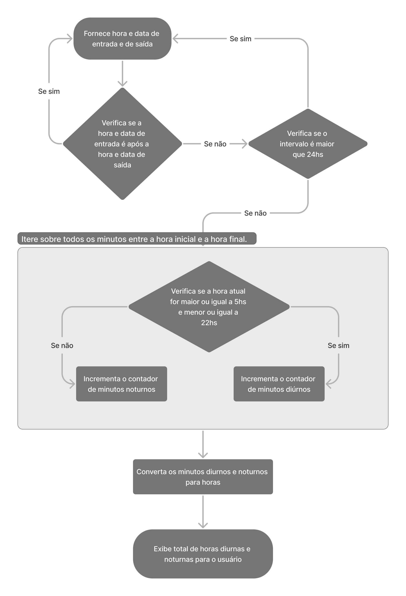

# Gerenciamento de Registros de Horas de Trabalho

Este projeto é uma aplicação de gerenciamento de registros de horas de trabalho desenvolvida para auxiliar na organização e acompanhamento das horas trabalhadas, distinguindo entre horas diurnas e noturnas.

## Fluxograma do Algorítimo de Cálculo de Horas em PDF

- [Fluxograma_time_tracker](Fluxograma_time_tracker.pdf)

## Requisitos

1. [x] PHP Obrigatório
2. [x] Cálculo no Back-End
3. [x] Entrega no GitHub
4. [x] Instruções no README
5. [x] Commits durante o Desenvolvimento
6. [x] Duração máxima inferior a 24h
7. [x] Usar Laravel com Vue
8. [x] Mostrar a quantidade de horas diurnas e noturnas trabalhadas
9. [x] Utilizar HTML, CSS, JavaScript
10. [x] Utilizar banco de dados MySql
11. [x] SPA

## Tecnologias Utilizadas

- **Frontend:** Vue.js 3
- **Backend:** Laravel 10

## Funcionalidades Principais

- **Registro de Horas:** Permite aos usuários registrar as horas trabalhadas, especificando se foram horas diurnas ou noturnas, além de outras informações relevantes, como data e atividades realizadas.

- **Visualização de Horas Trabalhadas:** Os usuários podem visualizar um resumo das horas trabalhadas em um determinado período, bem como análises detalhadas sobre as horas diurnas e noturnas separadamente.

## Como Rodar o Projeto

### Pré-requisitos

- Certifique-se de ter o [Node.js](https://nodejs.org/) instalado em sua máquina.
- Certifique-se de ter o [Composer](https://getcomposer.org/) instalado para gerenciar as dependências do Laravel.
- Certifique-se de ter o [MySQL](https://www.mysql.com/) instalado para gerenciar o banco de dados do Laravel.


### Passos para Execução

1. **Clone o Repositório:**
```bash
git clone https://github.com/Beortizz/time-tracker.git
cd time-tracker
```
2. **Instale as Dependências**
```bash
composer install
npm install
```
3. **Configure o ambiente**
 - Copie e cole o arquivo .env.example o nomeie .env
 - Atualize as seguintes variaveis para o seu banco de dados MySql
 ```properties
DB_CONNECTION=mysql
DB_HOST=127.0.0.1
DB_PORT=3306
DB_DATABASE=[nome_do_seu_banco]
DB_USERNAME=[seu_nome_de_usuario]
DB_PASSWORD=[sua_senha_super_segura]
```

4. **Crie a chave da aplicação**
```bash
php artisan key:generate
```

5. **Rode as Migrations**
```bash
php artisan migrate
```
6. **Rode o servidor de front-end**
```bash
npm run dev
```

7. **Rode o servidor de back-end**
```bash
php artisan serve
```

8. **Acesse o Link**
    
    [127.0.0.1:8000](http://127.0.0.1:8000)

## Fluxograma do Algorítimo de Cálculo de Horas

